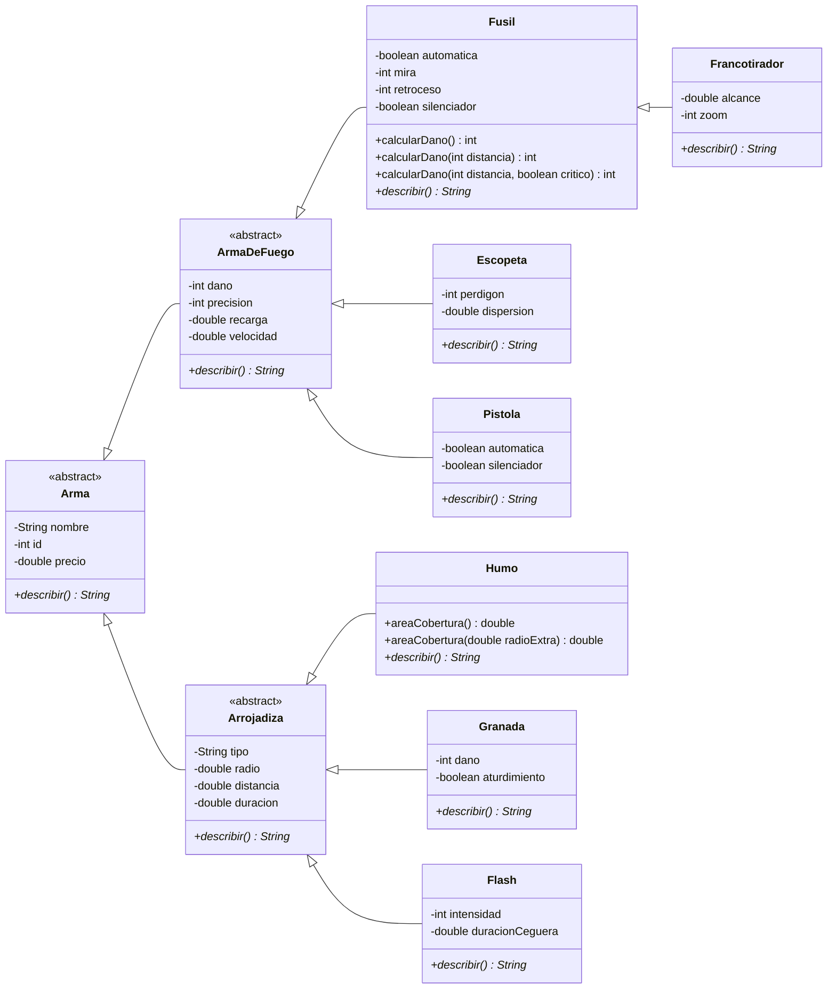
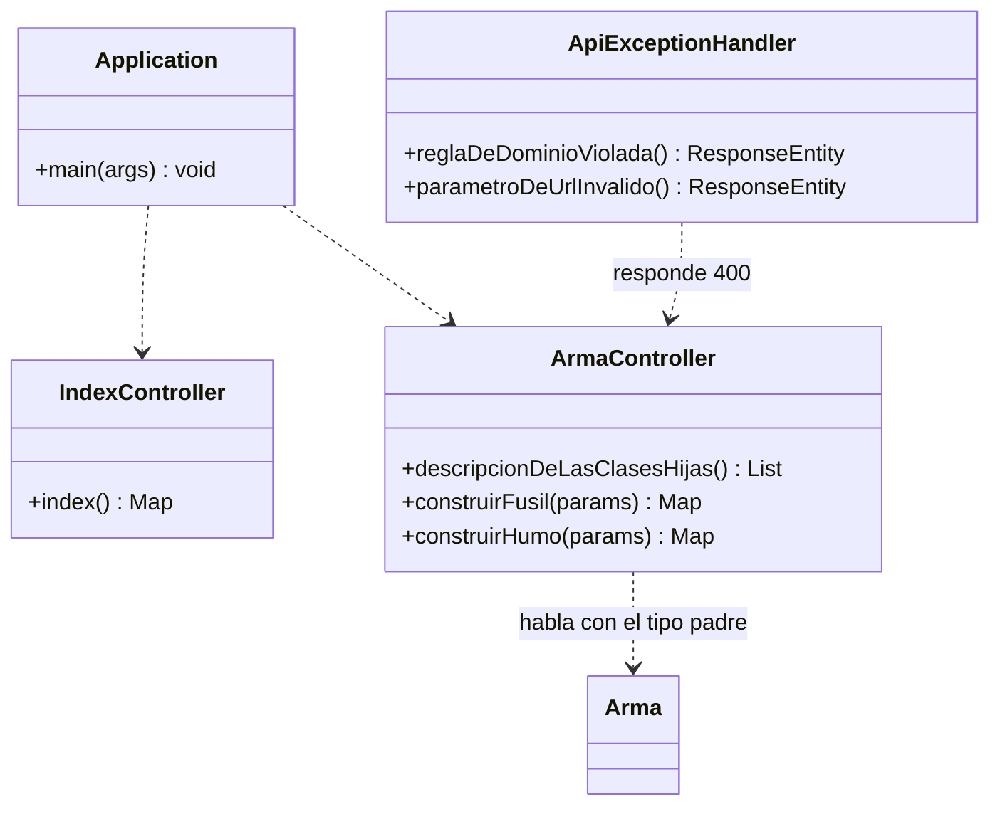

# cs2-armas-api

Servicio HTTP construido con **Spring Boot** (Maven, Java 21, Spring Web) sobre el
modelado de **Counter-Strike 2**: un inventario de armas con herencia,
sobreescritura, sobrecarga y ocultamiento de la información.

Ejercicio POO-06 del taller de Git y Lenguaje de Programación 3 (CYT646).
Enunciado: <https://github.com/alefq/afq-taller-git-2024/blob/main/docs/ejercicio-poo-06-revision-paquetes-constructores-2026-09-30.md>

## Cómo arrancar

```bash
./mvnw spring-boot:run
```

El servicio queda en `http://localhost:8080`. Los test corren con:

```bash
./mvnw test
```

## Servicios REST

### `GET /` — el servicio está vivo

```bash
curl http://localhost:8080/
```

```json
{"servicio":"cs2-armas-api","endpoints":[...],"estado":"activo"}
```

### `GET /api/armas/descripcion` — el mensaje abstracto de las dos clases hijas

El controller arma un `Fusil` y un `Humo`, los trata a ambos como `Arma`
(el tipo padre abstracto) y devuelve el texto de cada `describir()` sobreescrito:

```bash
curl http://localhost:8080/api/armas/descripcion
```

```json
[
  {"clase":"Fusil","heredaDe":"Arma","descripcion":"Fusil[nombre=AK-47, ...]"},
  {"clase":"Humo","heredaDe":"Arma","descripcion":"Humo[nombre=Humo de cortina, ...]"}
]
```

### `GET /api/armas/fusil` — construye desde la URL

Los parámetros alimentan un **constructor simple** (sin accesorios) o el
**constructor sobrecargado** (con mira / retroceso / silenciador). El daño
responde a la sobrecarga de `calcularDano()`:

```bash
curl "http://localhost:8080/api/armas/fusil?nombre=AK-47&mira=3&distancia=100&critico=true"
```

```json
{
  "clase":"Fusil",
  "descripcion":"Fusil[nombre=AK-47, ..., mira=3, retroceso=0, silenciador=false]",
  "dano":52,
  "sobrecargaDeCalcularDano":"distancia + crítico"
}
```

### `GET /api/armas/humo` — construye desde la URL

Elige el constructor simple, el sobrecargado por `radio`, o el completo por
`distancia`/`duración`. El área responde a `areaCobertura()` sobrecargado:

```bash
curl "http://localhost:8080/api/armas/humo?radio=10&radioExtra=2"
```

### Reglas del dominio invalidadas

```bash
curl -w "%{http_code}\n" "http://localhost:8080/api/armas/fusil?precio=-1"
```

```json
{"rechazo":"el dominio no permite ese estado","error":"El precio no puede ser negativo: -1.0"} [400]
```

## Diagrama Mermaid

Alineado con `src/main/java/py/edu/uc/lp3`. El domino vive en `domain`, la
entrada HTTP en `rest.controller` y `Application` solo arranca:





## Sobrecarga y sobreescritura: qué cambió

### Sobreescritura (en la clase hija, misma firma, otra implementación)

En la base `Arma` el método `describir()` dejó de tener cuerpo y pasó a ser
**abstracto** (`Arma.java`): el padre no sabe cómo describe cada tipo. Dos clases
hijas independientes implementan la misma firma `public String describir()`:

- `ArmaDeFuego` (rama de las armas de fuego) escribe atributos de disparo, y
  luego `Fusil`, `Escopeta`, `Pistola` y `Francotirador` reescriben encima.
- `Arrojadiza` (rama de las arrojadizas) escribe tipo, radio, distancia y
  duración, y luego `Humo`, `Granada` y `Flash` reescriben encima.

Se demuestra en `ArmaController.descripcionDeLasClasesHijas()`: se declaran
como `Arma`, se las construye como `Fusil` y `Humo`, y el texto que devuelven es
el del método sobreescrito (polimorfismo). El nivel intermedio
`ArmaDeFuego`/`Arrojadiza` implementa el abstracto y las clases concretas lo
vuelven a sobrescribir llamando a `super.describir()`.

### Sobrecarga (en la misma clase, mismo nombre, otra lista de argumentos)

- `Fusil.calcularDano()` / `calcularDano(int distancia)` /
  `calcularDano(int distancia, boolean disparoCritico)`: disparar sin más datos,
  indicando la distancia, o agregando si el disparo es crítico
  (`Fusil.java`).
- `Humo.areaCobertura()` / `areaCobertura(double radioExtra)`: el área sin
  más datos o sumando un radio extra (`Humo.java`).
- Constructores simples y sobrecargados: `Fusil` (2 firmas), `Humo` (3 firmas),
  todos llamando a `super(...)` para dejar el objeto en un estado legal.

### Cómo se distinguen

| Aspecto | Sobrecarga | Sobreescritura |
| --- | --- | --- |
| Dónde ocurre | Misma clase | Clase hija (y su base) |
| Firma | Misma nombre, **distinta** lista de argumentos | **Misma** firma exacta |
| Palabra clave | No requiere anotación | `@Override` |
| Efecto | Más formas de invocar la misma acción | Otra implementación del mismo mensaje |

## Ocultamiento e invariantes

Los atributos son privados y solo se cambian por constructores o setters que
validan (precio no negativo, `id > 0`, precisión entre 0 y 100, radio mayor a 0,
etc.). Si la regla se rompe, el dominio lanza `ArmaInvalidaException` y el
controller responde `400` con el motivo.

> Pregunta de la rúbrica aplicada al dominio: **¿puede el controller asignar a
> mano el daño o el precio?** No. `Arma.dano` y `Arma.precio` son privados; el
> controller no ve los atributos, solo recibe valores por URL, construye la
> instancia y llama mensajes. El estado ilegal lo rechaza la clase.

## Proyecto

```
src/main/java/py/edu/uc/lp3/Application.java            arranque de Spring Boot
src/main/java/py/edu/uc/lp3/domain/                      modelado de Counter-Strike 2
src/main/java/py/edu/uc/lp3/exceptions/ArmaInvalidaException.java
src/main/java/py/edu/uc/lp3/rest/controller/             servicios REST
src/test/java/py/edu/uc/lp3/                             pruebas de dominio y HTTP
```

## Licencia

Apache License 2.0. Ver [LICENSE](LICENSE).

## Commits de la solución

- Enlace al commit de la solución: <https://github.com/MauricioPecci/MPecci-tplp3-2026/commit/d3f92d1ca1691087a2f1549638f32a6262a2d63e>
- Bitácora de asistencia de IA: [BITACORA.md](BITACORA.md)
- Especificaciones para el aula: [docs/especificaciones-poo06-cs2.md](docs/especificaciones-poo06-cs2.md)